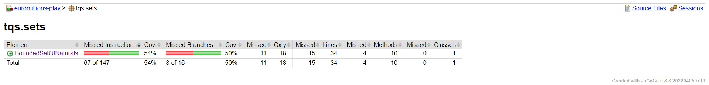
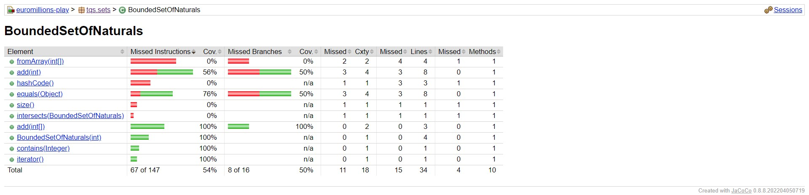
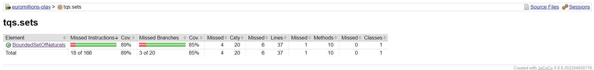
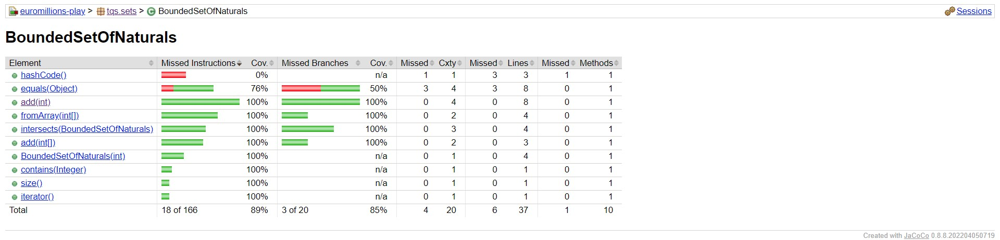

# Exercise 2:  EuroMillions
In this exercise we practice writing and running tests for a project called "Euromillions-play" and improving its test coverage.

## Key Takeaways
The key takeaways from this exercise are:

1.  **Familiarity with a real-world project and its test suite:** The exercise involves working with a real-world project called "euromillions-play" and its existing test suite. This provides an opportunity to gain practical experience working with a codebase that has already been developed and tested.
    
2.  **Writing unit tests for a bounded set data structure:** The exercise requires writing unit tests for a bounded set data structure called BoundedSetOfNaturals. This provides an opportunity to practice writing effective unit tests for a non-trivial data structure.
    
3.  **Measuring code coverage with Jacoco:** The exercise involves configuring the project to measure code coverage using Jacoco, a code coverage tool for Java projects. This provides an opportunity to learn how to use a code coverage tool to measure how much of the code is being exercised by the test suite.
    
4.  **Debugging and fixing failing tests:** The exercise involves debugging and fixing a failing test. This provides an opportunity to learn how to use the test suite to identify and fix bugs in the code.
    
5.  **Evaluating test suite effectiveness:** The exercise involves evaluating the effectiveness of the test suite by analyzing the code coverage report generated by Jacoco. This provides an opportunity to learn how to use a code coverage report to identify areas of the code that are not being tested effectively and to improve the test suite accordingly.

Overall, this exercise provides a practical introduction to software testing and quality assurance, including writing effective unit tests, measuring code coverage, and evaluating the effectiveness of a test suite.

## Steps
**Step 2a: Pull the project and familiarize yourself with the solution**
The first step is to pull the "euromillions-play" project and get familiar with the code. The project includes several classes and tests, including:

- `BoundedSetOfNaturals`: a data structure that represents a set of natural numbers within a specified range
- `Dip`: a collection of 5 "numbers" and 2 "stars" for a EuroMillions bet
- `CouponEuromillion`: one or more `Dip` objects, representing a player's bet
- `EuromillionsDraw`: a class that holds the winning `Dip` and can find matches for a given player's `CouponEuromillion`

**Step 2b: Make necessary changes to existing tests** 

The next step is to make the necessary changes to the existing tests to ensure that they all pass. There is one failing test that needs to be fixed:

`testConstructorFromBadRanges` in `DipTest`: This test checks that the `Dip` constructor raises an exception if it is given an invalid number range. You will need to change the implementation of `Dip` to raise the expected exception when invalid numbers are given as input.

Note that it is possible to temporarily suspend a test using the `@Disabled tag`, which can be useful while debugging the tests themselves.

**Step 2c: Assess the test coverage level**

Once the tests are passing, the next step is to assess the test coverage level of the project. To do this, you will need to:

1. Configure the Maven project to run Jacoco analysis, if needed.

2. Run the Maven "test" goal and then "jacoco:report" goal. This should generate an HTML report in the `target/jacoco` directory.

3. Analyze the results to determine which classes and methods offer less coverage and if all possible decision branches are being covered.

4. Collect evidence of the coverage for `BoundedSetOfNaturals`.

Note that IntelliJ has an integrated option to run the tests with coverage checks, but doing it at the Maven level, allows the use of this feature in multiple tools.

**Step 2c: Write additional tests for BoundedSetOfNaturals**

The next step is to write additional tests for the `BoundedSetOfNaturals` class to ensure that it meets its expected contract. You should consider what kind of unit tests are worth writing for proper validation of `BoundedSetOfNaturals`.

**Step 2d: Run Jacoco coverage analysis and compare results**

Finally, run the Jacoco coverage analysis again and compare the results with the previous analysis. In particular, compare the "before" and "after" results for the `BoundedSetOfNaturals` class to see if the additional tests have improved the coverage.

## Evidence  of the  coverage for  “BoundedSetOfNaturals”

### Before

### After

