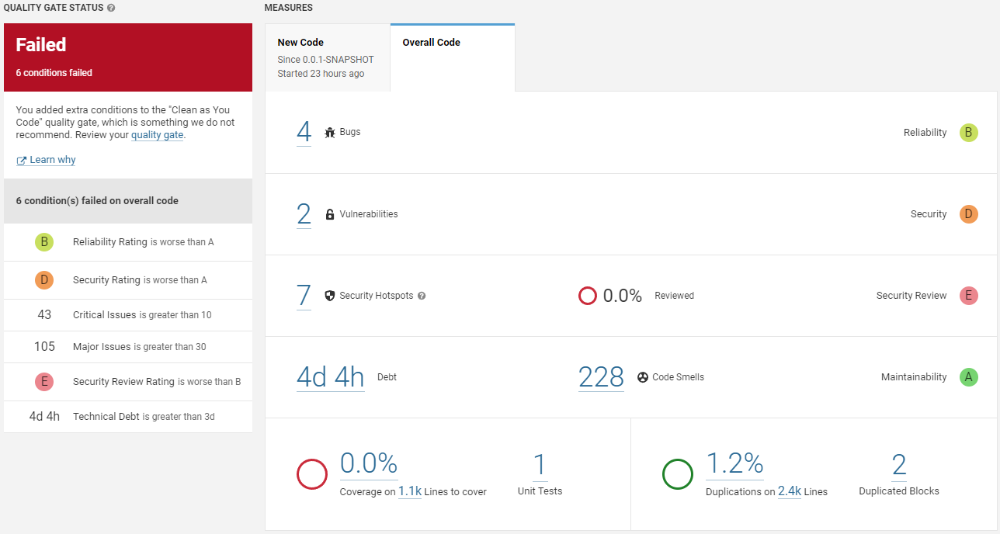

# Exercise 3:  Custom QG

## Review Questions

### a) Define a custom quality gate to this project. Feel free to mix the metrics but explain your chosen configuration.

I tested it on my IES project of last year.

| Condition | Threshold |
|-----------|-----------|
| Maintainability Rating | < A |
| Reliability Rating | < A |
| Reliability Remediation Effort | > 3h |
| Security Rating | < A |
| Security Review Rating | < B |
| Critical Issues | > 10 |
| Major Issues | > 30 |
| Technical Debt | > 3d |

### Explanation for Each Condition

- **Maintainability Rating is worse than A:** The threshold is set at A because it represents a desirable level of maintainability for the code. A lower rating could mean that future changes or fixes to the code may be more challenging or time-consuming.

- **Reliability Rating is worse than A:** We chose A as the threshold because it represents a good level of reliability for the code. If the reliability rating is worse than A, it could mean that the code has defects that could cause problems or errors in the system.

- **Reliability Remediation Effort is greater than 3h:** We set this threshold because we believe that any issues with the code should be resolved immediately. Waiting longer than 3 hours to fix a reliability issue could cause the system to become unreliable and unpredictable.

- **Security Rating is worse than A:** We chose A as the threshold because it represents a good level of security for the code. A lower rating could indicate that there are vulnerabilities in the code that hackers could exploit, putting the system and its users at risk.

- **Security Review Rating is worse than B:** We set this threshold a because we believe that thorough security review is essential to ensure the code is as secure as possible. A lower rating could indicate that the code hasn't been thoroughly checked for security issues.

- **Critical Issues is greater than 10:** If the code has more than 10 critical issues, it could indicate that the system is at risk of serious problems or security breaches.

- **Major Issues is greater than 30:** A code with more than 30 major issues indicates that there are too many significant problems that could make it harder to understand and improve the system.

- **Technical Debt is greater than 3d:** It's important to address technical debt promptly. Waiting longer than 3 days to address technical debt could make it harder to fix the issue later and could potentially cause more problems in the system.

## Image reports

### Default quality gate

### Custom quality gate

