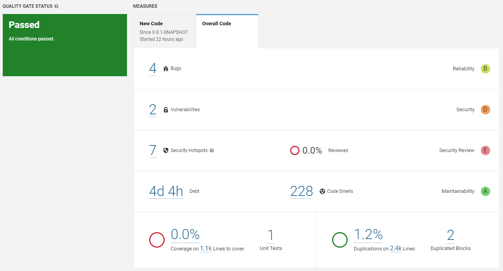

# Exercise 3:  Custom QG

## Review Questions

### a) Define a custom quality gate to this project. Feel free to mix the metrics but explain your chosen configuration.

I tested it on my IES project of last year.

| Condition | Threshold |
|-----------|-----------|
| Maintainability Rating | < A |
| Reliability Rating | < A |
| Reliability Remediation Effort | > 3h |
| Security Rating | < A |
| Security Review Rating | < B |
| Critical Issues | > 10 |
| Major Issues | > 30 |
| Technical Debt | > 3d |

### Explanation for Each Condition

- **Maintainability Rating is worse than A:** The threshold is set at A because it represents a desirable level of maintainability for the code. Our code should be easy to update and fix.

- **Reliability Rating is worse than A:** If the reliability rating is worse than A, it could mean that the code has defects that might cause problems or errors in the system.

- **Reliability Remediation Effort is greater than 3h:** We set this threshold because we believe that any issues with the code should be resolved immediately.

- **Security Rating is worse than A:** The code should be free of vulnerabilities that hackers can exploit, putting the system and its users at risk.

- **Security Review Rating is worse than B:** A thorough security review is essential to ensure the code is as secure as possible.

- **Critical Issues is greater than 10:** If the code has more than 10 critical issues, it could indicate that the system is at risk of serious problems or security breaches.

- **Major Issues is greater than 30:** A code with more than 30 major issues indicates that there are too many significant problems that could make it harder to understand and improve the system.

- **Technical Debt is greater than 3d:** It's important to address technical debt promptly (stop stacking problems). 3 days seems like a resaonable amount of time to address technical debt.

## Image reports

### Default quality gate

### Custom quality gate

